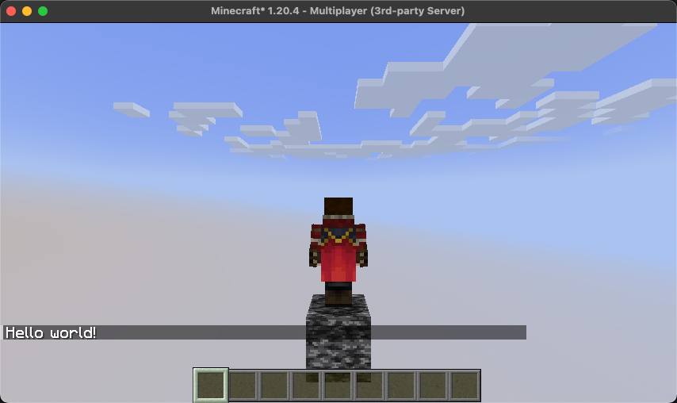

# Pierwszy projekt – Wprowadzenie do SessionAPI

Proste wprowadzenie do pracy z SessionAPI, obejmujące podstawy zarządzania sesjami i komponentami.



## Listenery w bibliotece

Każdy komponent w bibliotece (Session, Board, Controller) posiada wbudowane listenery, które odpowiadają za różne etapy
życia komponentu oraz interakcję z graczami.

* **componentConstructor()** – Wywoływany automatycznie, gdy komponent zostaje utworzony. Używany do inicjalizacji
  komponentu (np. tworzenie zasobów, uruchamianie wątków, inicjowanie logiki).

* **componentDestructor()** – Wywoływany automatycznie, gdy komponent jest wyłączany. Używany do usuwania zasobów i
  elementów stworzonych przez komponent (np. zatrzymywanie wątków, czyszczenie danych).

* **playerConstructor(PlayerConstructorEvent)** – Wywoływany automatycznie, gdy gracz dołącza do sesji (lub jeśli
  komponent został uruchomiony po dołączeniu gracza). Używany do nadania graczowi właściwości, przenoszenia go na mapę
  itp.

* **playerDestructor(PlayerDestructorEvent)** – Wywoływany automatycznie, gdy gracz opuszcza sesję. Używany do usuwania
  właściwości gracza, które były przypisane na potrzeby sesji (np. usuwanie efektów czy zmiany statusu).

## Tworzenie głównej klasy kontenera

**Session** to klasa zarządzająca sesją gry, odpowiadająca za graczy, mapę i kontrolery. Inicjuje, uruchamia i kończy
sesję, zapewniając organizację i kontrolę nad grą.

```java
public class MyContainer extends Session {
	public MyContainer(JavaPlugin plugin) {
		super(plugin);
	}

	@NotNull
	@Override
	// Ta metoda jest wywoływana automatycznie, aby zdefiniować domyślną mapę dla kontenera.
	// Mapa może być później zmieniona za pomocą metody .setBoard(#Board), jeśli zajdzie taka potrzeba.
	protected Board getDefaultStartBoard() {
		return new MyBoard(this);
	}

	@Override
	// Ta metoda jest wywoływana automatycznie w momencie tworzenia instancji sesji.
	public void componentConstructor(ComponentConstructorEvent event) {
		super.componentConstructor(event);
		// Aby dodać kontroler do drzewa komponentów sesji, tworzymy jego instancję,
		// a jako argument przekazujemy "this", co oznacza, że kontroler będzie podłączony do bieżącej sesji.
		// Następnie uruchamiamy kontroler, aby zaczął działać.
		new MyController(this).start();
	}
}

```

### Najważniejsze listenery

* **componentConstructor()** – Wywoływany automatycznie podczas tworzenia instancji sesji, używany do uruchomienia
  wymaganych zasobów.

* **componentDestructor()** – Wywoływany automatycznie podczas usuwania sesji, służy do zwolnienia i usunięcia zasobów.

::: tip
Biblioteka automatycznie śledzi utworzone komponenty oraz wątki, dlatego nie musisz używać metody
`componentDestructor()` do ich zwolnienia – zrobi to za Ciebie.
:::

### Najważniejsze metody

* **start()** – Uruchamia sesję, buduje mapę, oraz inicjuje i uruchamia wszystkie kontrolery.

* **stop()** – Usuwa sesję, w tym strukturę, mapę i graczy, a także usuwa listenery oraz wątki związane z sesją.

* **addPlayer(#Player)** – Dodaje gracza do kontenera.

* **removePlayer(#Player)** – Usuwa gracza z kontenera.

* **setBoard(#Board)** – Zmienia mapę w sesji.

## Tworzenie klasy odpowiedzialnej za mapę

Board to klasa reprezentująca mapę, odpowiedzialna za jej budowanie i usuwanie. Posiada listenery do obsługi tworzenia i
niszczenia planszy, a także do inicjalizacji graczy.

```java
public class MyBoard extends Board {
	public MyBoard(Session session) {
		super(session);
	}
}
```

### Najważniejsze listenery

* **generate()** – Wywoływany do zbudowania mapy.

* **degenerate()** – Wywoływany do usunięcia mapy.

::: tip
Klasa Board zawiera domyślne metody do budowania i niszczenia mapy, oparte na schematach FAWE. Zwykle nie ma potrzeby
ich przeciążania, ponieważ biblioteka zapewnia wystarczające rozwiązania. Przeciążenie metod `generate()` i
`degenerate()`
jest konieczne tylko w przypadku specjalnych, niestandardowych operacji.
:::

## Tworzenie kontrolera

Kontroler obsługuje logikę dla graczy. W tym przypadku wysyłamy wiadomość "Hello, world!" do każdego gracza, który
dołącza do kontenera.

```java
public class MyController extends Controller {
	public MyController(ISessionComponent sessionComponent) {
		super(sessionComponent);
	}

	@Override
	public void playerConstructor(PlayerConstructorEvent event) {
		super.playerConstructor(event);
		var player = event.getPlayer();
		player.sendMessage("Hello world!");
	}
}
```

### Najważniejsze listenery

* **getListener()** : *Listener (Bukkit)* – Metoda wywoływana automatycznie. Jej zadaniem jest zwrócenie obiektu typu
  Listener, który będzie obsługiwał zdarzenia związane z danym kontrolerem w systemie Bukkit.

::: tip
Biblioteka automatycznie zarządza cyklem życia Listenerów (Bukkit). Kiedy kontroler zostanie uruchomiony, a dla niego
nie ma aktywnego listenera, framework stworzy nową instancję i załaduje go. Gdy listener nie będzie już potrzebny (np.
gdy żaden kontener nie używa danego komponentu), SessionAPI usunie go z serwera, dbając o wydajność. Biblioteka unika
duplikowania listenerów, aby zapewnić optymalną pracę systemu.
:::

* **

## Uruchamianie kontenera instancji sesji

Aby uruchomić kontener, tworzymy jego instancję i wywołujemy metodę start(). Dodanie gracza do kontenera wywołuje
przygotowaną logikę, np. powitanie.

```text
var container = new MyContainer(plugin);
container.start();
container.addPlayer(player);
```

## Utworzona struktura drzewa sesji

Po uruchomieniu sesji zostanie stworzona zaplanowana struktura drzewa, która umożliwia łatwą wymianę rozwiązań, ponieważ
wszystko jest obudowane w komponenty. Jest ona dobrze ustrukturyzowana i zapewnia przewidywalne zwalnianie zasobów.
Kiedy fragment drzewa zostaje odłączony, wszystkie jego elementy, łącznie z dziećmi, są rekurencyjnie niszczone, a
listenery uruchamiane w przewidywalnej kolejności.

